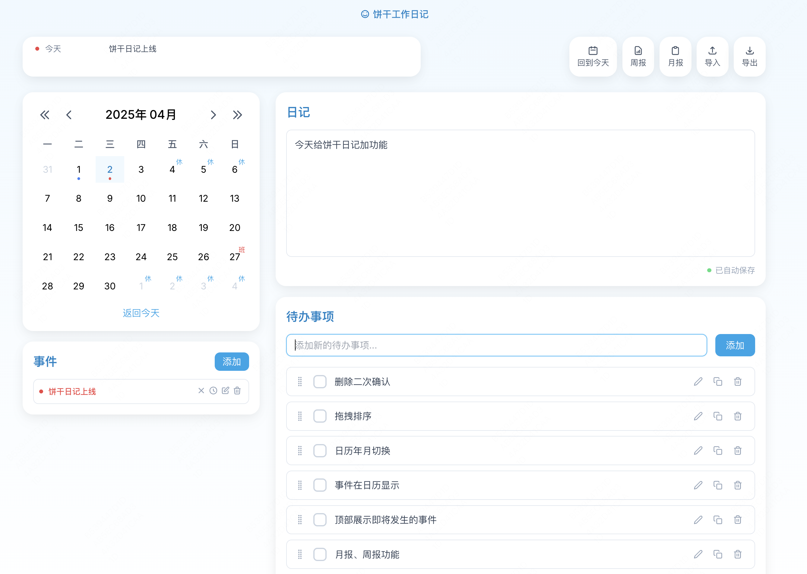
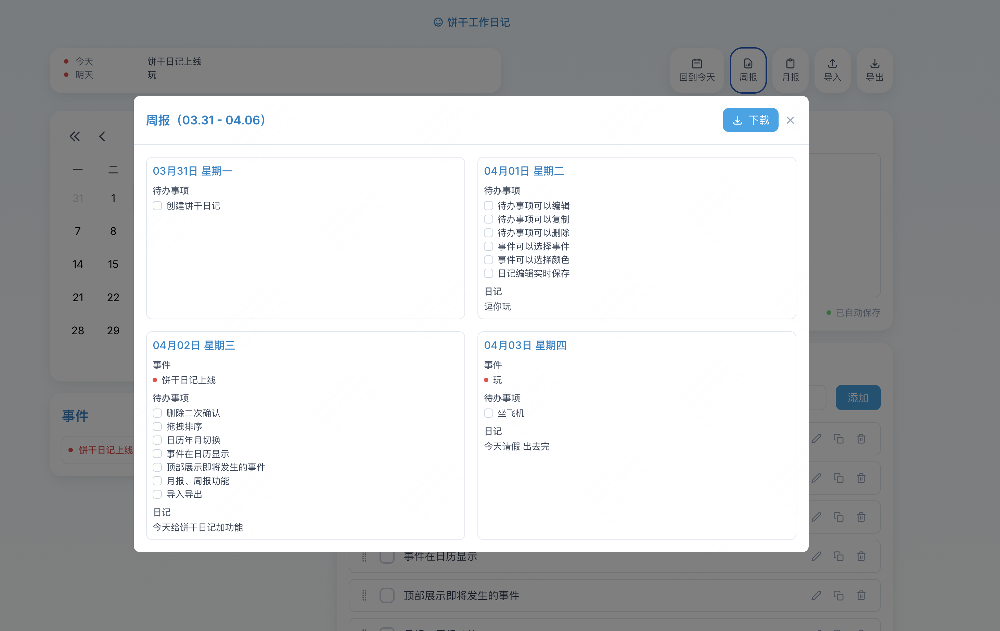

# 饼干工作日记 (Cookie Work Diary)

一个现代化的个人工作记录应用，用于管理日常工作中的事件、待办事项和日记。像饼干一样，让记录工作变得香甜轻松。

请访问 https://idonteatcookie.github.io/cookie-notes/ 查看效果




## 功能概述

### 1. 日历视图
- 位于左侧栏顶部
- 支持月份切换（上/下月按钮）
- 显示当前月份的完整日历
- 日期格式化显示（周一至周日）
- 特殊日期标记：
  - 当前选中日期：浅蓝色背景高亮
  - 非当前月份日期：浅灰色显示
  - 含有事件的日期：在日期下方显示对应事件颜色的小圆点
  - 法定节假日：右上角显示"休"标记（红色）
  - 调休工作日：右上角显示"班"标记（蓝色）
- 右键点击日期可快速添加事件
- 点击日期可切换选中状态

### 2. 事件管理
- 位于左侧栏日历下方
- 事件列表功能：
  - 显示当天所有事件
  - 每个事件显示标题和颜色标记（左侧小圆点）
  - 事件状态显示：
    - 活动：正常显示
    - 取消：标题后显示"（已取消）"，灰色
    - 延期：标题后显示"（已延期）"，灰色
- 事件操作：
  - 添加新事件：
    - 点击顶部"添加"按钮
    - 在弹出窗口中填写：
      - 事件标题（必填）
      - 日期（默认为当前选中日期）
      - 颜色（6种可选）
  - 编辑事件（铅笔图标）：
    - 可修改标题、日期和颜色
  - 标记取消（叉号图标）：
    - 点击后事件变为已取消状态
    - 不会在日历和顶部即将发生的事件中显示
  - 标记延期（时钟图标）：
    - 点击后事件变为已延期状态
    - 不会在日历和顶部即将发生的事件中显示
  - 恢复事件（循环图标）：
    - 仅对已取消或已延期的事件显示
    - 点击后恢复为活动状态
  - 删除事件（垃圾桶图标）：
    - 永久删除该事件
- 事件属性：
  - 标题：单行文本
  - 日期：日期选择器
  - 颜色标记：
    - 红色（bg-red-500）
    - 黄色（bg-yellow-500）
    - 蓝色（bg-blue-500）
    - 绿色（bg-green-500）
    - 紫色（bg-purple-500）
    - 粉色（bg-pink-500）
  - 状态：
    - active（活动）
    - cancelled（已取消）
    - postponed（已延期）

### 3. 待办事项
- 位于右侧栏下方
- 功能特点：
  - 快速添加：
    - 顶部输入框直接输入内容
    - 回车或点击"添加"按钮保存
  - 显示当天所有待办事项
  - 完成状态切换：
    - 点击复选框切换
    - 完成后显示删除线和灰色文本
  - 编辑功能：
    - 点击编辑图标打开编辑窗口
    - 可修改内容和日期
  - 复制功能：
    - 点击复制图标创建相同内容的新待办
    - 可修改日期
  - 删除功能：
    - 点击删除图标永久删除
- 待办项显示：
  - 复选框：
    - 未完成：空心方框
    - 已完成：蓝色背景带对勾
  - 内容：单行文本
  - 操作按钮：
    - 编辑（铅笔图标）
    - 复制（复制图标）
    - 删除（垃圾桶图标）

### 4. 日记
- 位于右侧栏顶部
- 功能特点：
  - 多行文本编辑器
  - 自动保存：
    - 停止输入1秒后自动保存
    - 底部显示保存状态：
      - 保存中：蓝色小圆点动画
      - 已保存：绿色小圆点
  - 支持基本文本格式
  - 按日期独立存储

### 5. 顶部功能区

#### 5.1 即将发生的事件
- 位于顶部左侧，白色卡片背景
- 最大高度100px，超出显示滚动条
- 显示内容：
  - 今天及未来的活动事件
  - 每个事件显示：
    - 左侧彩色小圆点（事件颜色）
    - 中间显示时间（今天/明天/具体天数）
    - 右侧显示事件标题
- 无事件时显示"暂无即将发生的事件"

#### 5.2 快捷功能按钮
- 位于顶部右侧
- 按钮样式：
  - 白色背景
  - 圆角设计
  - 图标+文字组合
  - 悬浮时图标变色
- 功能按钮：
  - 今天：
    - 日历图标
    - 点击跳转到今天日期
  - 周报：
    - 图表图标
    - 点击打开周报弹窗
  - 月报：
    - 文档图标
    - 点击打开月报弹窗
  - 导入：
    - 上传图标
    - 点击打开文件选择器
  - 导出：
    - 下载图标
    - 点击直接下载数据文件

### 6. 数据导入导出

#### 导出功能
- 文件格式：纯文本（.txt）
- 文件命名：工作记录_yyyy-MM-dd.txt
- 内容格式：
```
工作记录导出

=== 2024年03月25日 星期一 ===

【事件】
- 项目会议
- 代码审查

【待办事项】
- [✓] 准备会议文档
- [ ] 完成功能开发

【日记】
今天主要进行了项目评审，讨论了新功能的实现方案...

----------------------------
```

#### 导入功能
- 支持格式：.txt文本文件
- 导入步骤：
  1. 点击导入按钮
  2. 选择文件
  3. 确认导入（会清除现有数据）
  4. 导入成功后自动刷新页面
- 导入规则：
  - 自动识别日期分隔符
  - 按类型分类内容
  - 保持原有的完成状态
  - 生成新的ID

### 7. 报告生成

#### 周报功能
- 日期范围：周一至周日
- 弹窗显示：
  - 标题：周报（MM.dd - MM.dd）
  - 网格布局（2列）
  - 按日期分组显示
- 导出格式：
  - 文件名：周报_yyyy-MM-dd.txt
  - 内容格式同数据导出

#### 月报功能
- 日期范围：当月1日至最后一日
- 弹窗显示：
  - 标题：yyyy年MM月月报
  - 网格布局（2列）
  - 按日期分组显示
- 导出格式：
  - 文件名：月报_yyyy-MM-dd.txt
  - 内容格式同数据导出

## 界面设计

### 整体布局
- 背景：
  - 渐变：from-primary-50 to-white
  - 最小高度：100vh
- 内容区：
  - 最大宽度：1440px
  - 居中显示
  - 内边距：24px
- 响应式设计：
  - 桌面端（>1024px）：
    - 左侧：日历+事件（4列）
    - 右侧：日记+待办（8列）
  - 平板端（768px-1024px）：
    - 单列布局
    - 保持卡片间距
  - 移动端（<768px）：
    - 单列布局
    - 减小内边距和间距

### 卡片样式
- 背景：纯白（bg-white）
- 圆角：16px（rounded-xl）
- 阴影：
  - 0 2px 15px -3px rgba(0, 0, 0, 0.07)
  - 0 10px 20px -2px rgba(0, 0, 0, 0.04)
- 内边距：16px
- 间距：24px

### 色彩系统
- 主色调：
  - 主要蓝色：
    - 50: #f0f9ff
    - 100: #e0f2fe
    - 200: #bae6fd
    - 300: #7dd3fc
    - 400: #38bdf8
    - 500: #0ea5e9
    - 600: #0284c7
    - 700: #0369a1
  - 次要灰色：
    - 50: #f8fafc
    - 100: #f1f5f9
    - 200: #e2e8f0
    - 300: #cbd5e1
    - 400: #94a3b8
    - 500: #64748b
    - 600: #475569
    - 700: #334155
- 状态颜色：
  - 成功：#22c55e
  - 警告：#eab308
  - 错误：#ef4444
- 文字颜色：
  - 主要文字：#475569
  - 次要文字：#64748b
  - 提示文字：#94a3b8

### 交互设计
- 按钮交互：
  - 默认状态：白色背景
  - 悬浮状态：
    - 主要按钮：深蓝色
    - 次要按钮：浅灰背景
  - 点击效果：略微下沉
- 输入框交互：
  - 获得焦点：蓝色边框+浅蓝色阴影
  - 错误状态：红色边框
- 过渡动画：
  - 所有颜色变化：0.2s
  - 背景色变化：0.2s
  - 阴影变化：0.2s
- 操作提示：
  - 位置：元素底部
  - 背景：深灰色半透明
  - 文字：白色
  - 圆角：4px
  - 显示动画：淡入/淡出
- 加载状态：
  - 小圆点动画
  - 半透明遮罩
  - 居中loading图标

## 数据存储
- 存储方式：localStorage
- 数据结构：
```typescript
interface Note {
  id: string;
  content: string;
  date: string;
  createdAt: string;
  updatedAt: string;
}

interface Todo {
  id: string;
  content: string;
  completed: boolean;
  date: string;
  createdAt: string;
  completedAt?: string;
}

interface Event {
  id: string;
  title: string;
  date: string;
  color: string;
  createdAt: string;
  status?: 'active' | 'cancelled' | 'postponed';
}
```
- 存储键名：
  - notes：笔记数据
  - todos：待办事项数据
  - events：事件数据
- 自动保存机制：
  - 防抖时间：1000ms
  - 保存时机：
    - 内容变化
    - 状态变化
    - 删除操作

## 技术栈
- Next.js 14.1.3
- React 18
- TypeScript 5
- Tailwind CSS 3.3.0
- date-fns 2.30.0（日期处理）
- react-icons 4.12.0（图标库）

## 开发环境设置

### 系统要求
- Node.js 18.0.0 或更高版本
- npm 8.0.0 或更高版本

### 安装步骤
```bash
# 克隆项目
git clone [repository-url]
cd cookie-notes

# 安装依赖
npm install

# 启动开发服务器
npm run dev

# 构建生产版本
npm run build

# 启动生产服务器
npm run start

# 运行代码检查
npm run lint
```

### 开发模式
- 开发服务器：http://localhost:3000
- 热更新：支持
- 环境变量：
  - NODE_ENV=development
  - NEXT_PUBLIC_API_URL=http://localhost:3000

## 浏览器支持
- Chrome 90+（推荐）
- Firefox 90+
- Safari 14+
- Edge 90+

## 部署要求
- Node.js 18.0.0+
- 内存：至少512MB
- 存储：至少100MB
- 网络：支持HTTP/HTTPS
